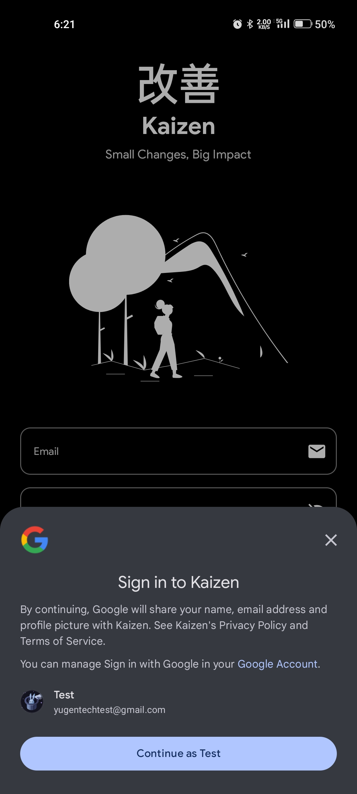
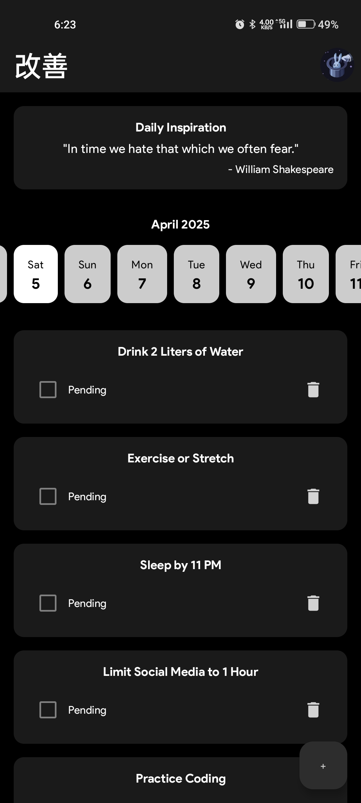
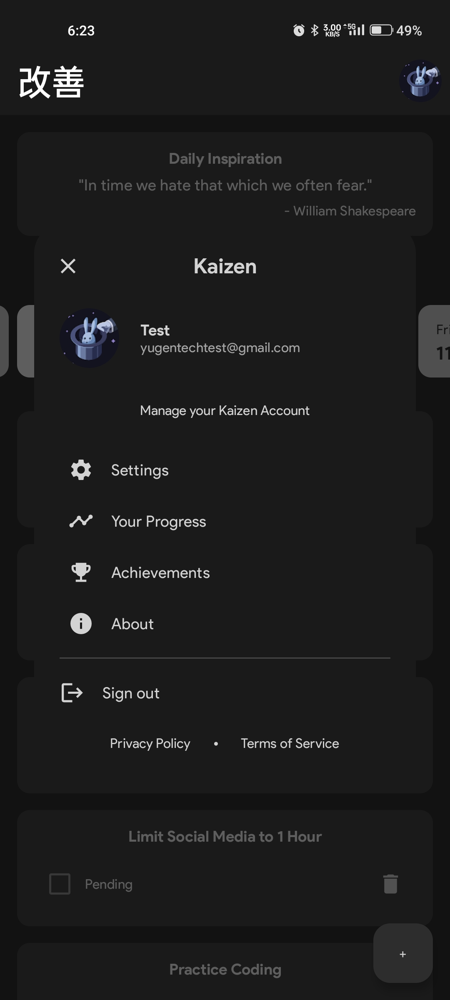
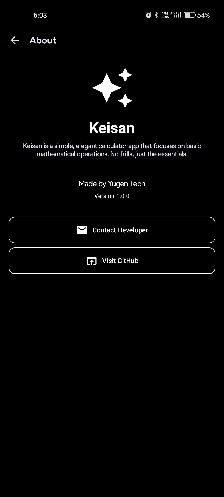

# 🌸 Kaizen - Your Journey to Daily Growth

Welcome to **Kaizen**, your personalized companion for self-improvement and mindful living. Inspired by the Japanese philosophy of continuous growth, Kaizen empowers you to build positive habits, track your progress, and evolve every single day — one small step at a time.

---

## ✨ Features

- **Daily Habit Building**: Cultivate habits that align with your personal and professional goals.
- **Progress Tracking**: Visualize your journey with daily habit completion tracking.
- **Motivational Quotes**: Start your day with inspiring quotes to stay motivated and focused.
- **Elegant UI**: Designed with a minimalistic and calming interface using Jetpack Compose.
- **First-Time Setup**: Auto-generated helpful habits to kickstart your self-improvement journey.

---

## 🎨 UI Highlights

- **Sophisticated Design**: Clean, modern layouts crafted to encourage focus and mindfulness.
- **Dynamic Experience**:
  - A **Dashboard Screen** showcasing motivational quotes and daily habits.
  - An intuitive **Date Picker** for reflecting on your past progress.
- **Smooth Animations**: Carefully designed transitions to enhance the overall experience without distractions.

---

## 🚀 Technologies Used

- **Language**: Kotlin  
- **UI Framework**: Jetpack Compose  
- **State Management**: DataStore  
- **Backend Integration**: Firestore for cloud storage  
- **Architecture**: Clean MVVM pattern with Repository abstraction

---

## 📸 Screenshots

<div align="center">
  



<br/><br/>





</div>

---

## 🛠️ Setup & Installation

1. **Clone the Repository**:
   ```bash
   git clone https://github.com/MohammadAliUstad/Kaizen.git
   cd kaizen
   ```
2. **Open in Android Studio**: Import the project and sync Gradle files.  
3. **Run**: Build and run the app on an emulator or physical device.

---

## 🌟 Contributing

Passionate about self-improvement too?  
Contributions are welcome! Feel free to fork the repository, make enhancements, and submit a pull request.

---

## 📞 Contact

Have feedback, ideas, or questions? Feel free to reach out:  
📧 **Mohammadaliustad@gmail.com**

---

**Made with ❤️ for personal growth by Yugen Tech**

---
